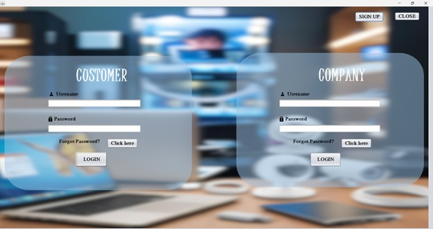
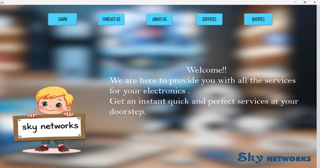
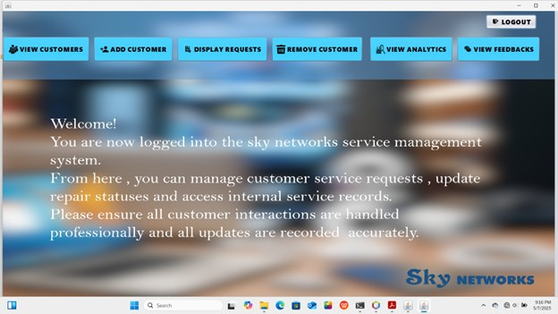
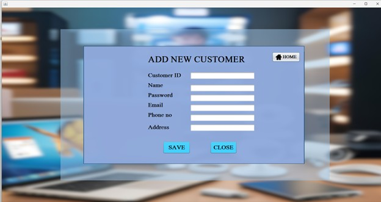
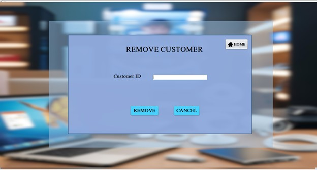
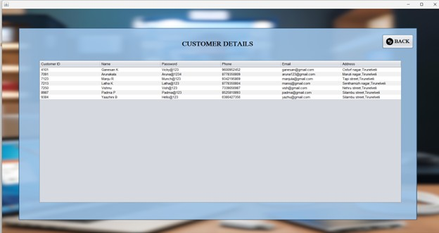
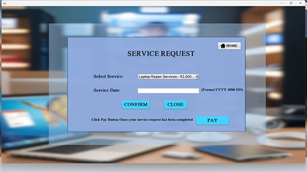
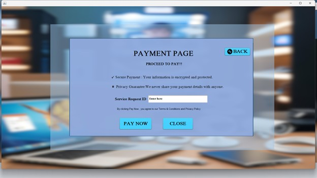
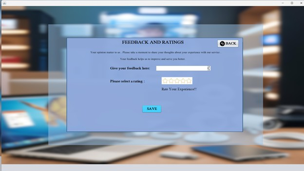
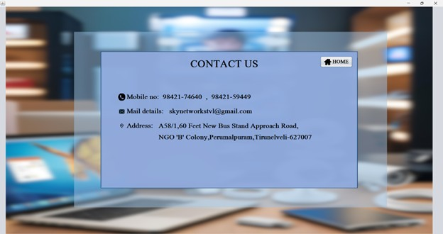

# Service Management System

## Project Overview

The Service Management System is a Java-based desktop application developed to manage customer services efficiently. The system provides a structured platform for handling customer records, service requests, payments, and feedback through a graphical user interface.

This project demonstrates the implementation of Java Swing for GUI development and JDBC for database connectivity.

---

## Features

- Secure Login System  
- Admin Dashboard  
- Add Customer  
- Remove Customer  
- Display Customer Records  
- Service Request Management  
- Payment Processing  
- Feedback Collection  
- Contact Us Page  

---

## Technologies Used

- Java  
- Java Swing  
- MySQL Database  
- JDBC (Java Database Connectivity)  
- NetBeans IDE  

---

## Project Structure

- Login Module  
- Admin Home Page  
- Customer Management Module  
- Service Request Module  
- Payment Module  
- Feedback Module  
- Contact Module  
- Database Connection Class  

---

## Application Screenshots

### Login Page

### Dashboard

### Admin Home Page

### Add Customer

### Remove Customer

### Display Records

### Service Request

### Payment Page

### Feedback Page

### Contact Us Page

---

## How to Run the Project

1. Clone the repository:
   git clone https://github.com/gayu2707/Service-Management.git

2. Open the project in NetBeans, Eclipse, or IntelliJ IDEA.

3. Configure the MySQL database:
   - Create a database.
   - Import the required tables.
   - Update the database username and password in the connection file.

4. Run the main Java file.

---

## Learning Outcomes

- Developed a desktop application using Java Swing.
- Implemented CRUD operations.
- Integrated MySQL database using JDBC.
- Designed structured GUI-based systems.
- Improved understanding of database-driven applications.

---

## Future Enhancements

- Role-based authentication system  
- Report generation  
- Improved UI design  
- Enhanced validation and error handling  
- Cloud-based database integration  

---

## Contributors

This project was developed as a collaborative academic project by:

- Gayathri K  
- Gayathri  S
- Yoghya Abiraami U M 
